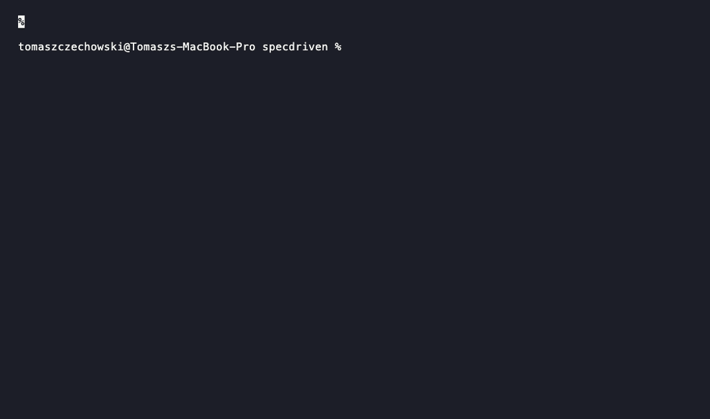

<div align="center">
  
</div>

<p align="center">
  <a href="https://specdriven.sh"></a>
  <a href="https://github.com/tomaszczechowski/specdriven-specs/tree/main/content/specs"></a>
  <a href="https://github.com/tomaszczechowski/specdriven/commits/main"></a>
  <a href="https://www.npmjs.com/package/specdriven"></a>
  <a href="./LICENSE"></a>
</p>

<p align="center">
  <a href="https://github.com/tomaszczechowski/specdriven-specs"></a>
  <a href="https://specdriven.sh"></a>
</p>

<p align="center">
  <a href="https://github.com/sponsors/tomaszczechowski"></a>
  <a href="https://www.buymeacoffee.com/tomaszczechowski"></a>
</p>

---

**Production project blueprints with AI built in.** Skip the three days of stack debates. Install an opinionated tech stack, architecture, file layout, and references to the AI workflows that fit — all from a single CLI command.

<p align="center">
  
</p>

## Quick Start

```bash
# Install a complete project spec
npx specdriven add nextjs-saas

# Or pick interactively
npx specdriven add

# Browse the catalog from the terminal
npx specdriven list
npx specdriven find next
```

That's it. The CLI fetches the spec from the public catalog and installs it into your agent's config directory — Claude Code, Cursor, Copilot, Codex, and 50+ others.

## What is SDD?

**Spec Driven Development (SDD)** is a methodology where AI-generated specifications drive your project from day one. Rather than bolting AI assistance onto an existing workflow, SDD treats specs as the source of truth — they describe your stack, your architecture, and the AI skills that come bundled with them.

A spec is the production-grade scaffold for a real project: opinionated tech, real architecture, file structure, and the AI workflows that pair with it. Each spec ships:

- **`SPEC.md`** — the blueprint body (markdown with YAML frontmatter)
- **`specdriven-metadata.json`** — catalog metadata: title, stack, tags, complexity, paired skills
- **Bundled skills** (optional) — inside `skills/<name>/`, installed alongside the spec
- **External skill references** (optional) — declared in the metadata, printed after install as `npx skills add ...` commands the user can copy-paste through the open [`skills` ecosystem CLI](https://www.skills.sh)

Internal skills are spec-specific (e.g. a code-reviewer tuned for the spec's stack). External skills point to generic skills already maintained elsewhere — specdriven never duplicates that content.

## Ecosystem

This repo is the **docs hub** for the project. The actual code and specs live in dedicated repos:

| Repo | Purpose |
|------|---------|
| **[specdriven-specs](https://github.com/tomaszczechowski/specdriven-specs)** | Community catalog of project specs (with bundled skills) |
| **[specdriven.sh](https://specdriven.sh)** | Web catalog, browse UI, and online docs |

The CLI source lives in a private repo and is published to npm as [`specdriven`](https://www.npmjs.com/package/specdriven).

## CLI Reference

Install once and use anywhere:

```bash
npm install -g specdriven
# or run ad-hoc via npx specdriven <command>
```

Global helpers:

```bash
specdriven --version            # print the installed version
specdriven --help               # top-level help
specdriven <command> --help     # per-command help (e.g. specdriven add --help)
```

### `add` — install a spec

```bash
specdriven add [slug] [options]
```

```bash
specdriven add nextjs-saas               # install a spec
specdriven add                           # interactive prompt
specdriven add nextjs-saas --global      # install into user-level config
specdriven add nextjs-saas --agent cursor # target a specific agent
```

After a successful install, the CLI prints any external skills paired with the spec as a list of `npx skills add ...` commands you can copy-paste.

| Option | Description |
|--------|-------------|
| `-a, --agent <id>` | Target agent (e.g. `claude-code`, `cursor`) |
| `-g, --global` | Install into the user-level config dir |
| `-d, --dest <path>` | Override the destination root |
| `-f, --force` | Overwrite if the destination already exists |
| `-y, --yes` | Skip prompts; require all args/flags |

### `find` — search the catalog

Partial-substring search across slug, title, description, and tags. Omit the query to list everything.

```bash
specdriven find [query]
```

```bash
specdriven find next                 # matches "nextjs-saas", "nestjs-api", etc.
specdriven find                      # list every spec in the catalog
```

_No options — this is a read-only search command._

### `list` (alias: `ls`) — browse the catalog

Lists the catalog alphabetically, 20 entries per page.

```bash
specdriven list
specdriven ls                        # alias form
```

_No options — output is paginated automatically._

### `init` — scaffold a new spec

Creates a new spec from the official template, ready to author and contribute back upstream.

```bash
specdriven init [slug] [options]
```

```bash
specdriven init my-new-spec
specdriven init my-stack --global
specdriven init                                  # interactive
specdriven init review-bot --agent cursor        # scaffold targeting cursor's layout
```

If `slug` is omitted, it defaults to `spec-example`.

| Option | Description |
|--------|-------------|
| `-a, --agent <id>` | Target agent (`claude-code`, `cursor`, etc.) |
| `-g, --global` | Scaffold into the user-level config dir |
| `-d, --dest <path>` | Override the destination root |
| `-f, --force` | Overwrite if the destination already exists |
| `-y, --yes` | Skip prompts; require all args/flags |

### `remove` (alias: `rm`) — uninstall

Removes a previously installed spec from your agent's config directory. Asks for confirmation unless `--yes` is passed.

```bash
specdriven remove <slug> [options]
```

```bash
specdriven remove nextjs-saas
specdriven rm nextjs-saas --yes              # alias + skip confirmation
specdriven remove my-stack --global          # remove from user-level config
specdriven rm nextjs-saas --agent cursor     # target a specific agent's path
```

| Option | Description |
|--------|-------------|
| `-a, --agent <id>` | Target agent |
| `-g, --global` | Remove from user-level config |
| `-d, --dest <path>` | Override the destination root |
| `-y, --yes` | Skip confirmation |

## Supported Agents

specdriven works with **55 AI coding agents** out of the box. Pass `--agent <id>` to target a specific one, or let the CLI auto-detect from your project. Agent IDs align with the open `skills` ecosystem so installed content interops across tools.

### Top 5

| Agent | ID |
|-------|----|
| Claude Code | `claude-code` |
| Cursor | `cursor` |
| GitHub Copilot | `github-copilot` |
| Codex | `codex` |
| OpenClaw | `openclaw` |

<details>
<summary><b>Show all 55 supported agents</b></summary>

<br/>

| Agent | ID |
|-------|----|
| AdaL | `adal` |
| AiderDesk | `aider-desk` |
| Amp | `amp` |
| Antigravity | `antigravity` |
| Augment | `augment` |
| Cline | `cline` |
| Code Studio | `codestudio` |
| CodeArts Agent | `codearts-agent` |
| CodeBuddy | `codebuddy` |
| Codemaker | `codemaker` |
| Codex | `codex` |
| Command Code | `command-code` |
| Continue | `continue` |
| Cortex Code | `cortex` |
| Crush | `crush` |
| Cursor | `cursor` |
| Claude Code | `claude-code` |
| Deep Agents | `deepagents` |
| Devin for Terminal | `devin` |
| Dexto | `dexto` |
| Droid | `droid` |
| Firebender | `firebender` |
| ForgeCode | `forgecode` |
| Gemini CLI | `gemini-cli` |
| GitHub Copilot | `github-copilot` |
| Goose | `goose` |
| Hermes Agent | `hermes-agent` |
| IBM Bob | `bob` |
| iFlow CLI | `iflow-cli` |
| Junie | `junie` |
| Kilo Code | `kilo` |
| Kimi Code CLI | `kimi-cli` |
| Kiro CLI | `kiro-cli` |
| Kode | `kode` |
| MCPJam | `mcpjam` |
| Mistral Vibe | `mistral-vibe` |
| Mux | `mux` |
| Neovate | `neovate` |
| OpenClaw | `openclaw` |
| OpenCode | `opencode` |
| OpenHands | `openhands` |
| Pi | `pi` |
| Pochi | `pochi` |
| Qoder | `qoder` |
| Qwen Code | `qwen-code` |
| Replit | `replit` |
| Roo Code | `roo` |
| Rovo Dev | `rovodev` |
| Tabnine CLI | `tabnine-cli` |
| Trae | `trae` |
| Trae CN | `trae-cn` |
| Universal | `universal` |
| Warp | `warp` |
| Windsurf | `windsurf` |
| Zencoder | `zencoder` |

> Missing your agent? [Open an issue](https://github.com/tomaszczechowski/specdriven/issues/new) and we'll add it.

</details>

## Contributing

This repo houses **docs and the project hub** — it doesn't accept spec submissions directly. Open contributions go to the catalog:

- 📋 **[specdriven-specs](https://github.com/tomaszczechowski/specdriven-specs)** — submit a project spec ([CONTRIBUTING](https://github.com/tomaszczechowski/specdriven-specs/blob/main/CONTRIBUTING.md))

CI validates frontmatter and content, a maintainer reviews, and on merge your contribution syncs to [specdriven.sh](https://specdriven.sh) within an hour.

For doc improvements, typo fixes, or issues with the CLI itself, open a PR or issue on this repo.

## Support

If specdriven saves you time, consider supporting development:

<p align="left">
  <a href="https://github.com/sponsors/tomaszczechowski"></a>
  &nbsp;
  <a href="https://www.buymeacoffee.com/tomaszczechowski"></a>
</p>

## Status

**v2.x — actively developed.** v2.0.0 introduced the spec-only model (skills are now bundled inside specs or referenced as external commands). See the [CHANGELOG](./CHANGELOG.md) for full migration notes.

## License

[MIT](./LICENSE) — Copyright (c) 2026 Tomasz Czechowski.
